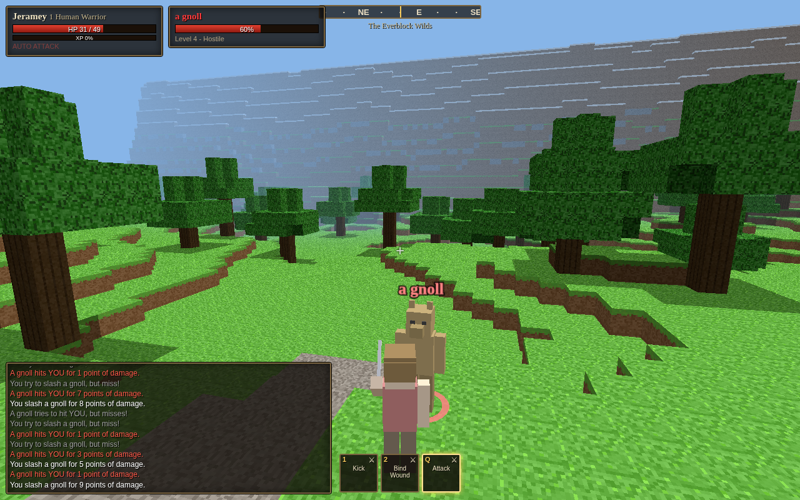
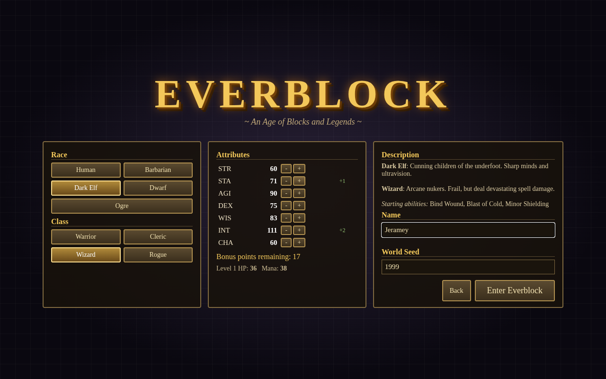

# Everblock


**[▶ Play in your browser](https://ssinjinx.github.io/everblock/)**

A blocky voxel world (Minecraft-style) that plays like **EverQuest Classic (1999)**. You roll a character (race, class, stat points), bind at Everblock Keep, hunt rats and gnolls outside the walls, then work your way through the Sunken Crypt and on to the Frostfang Highlands. There are con colors, auto attack, spell gems, med/sit regen, corpse runs, named mobs and camps. You can also break and place blocks anywhere.

Everything is generated in code: terrain, textures, models and sound. There are no external assets. The whole game is one self-contained `index.html` (Three.js r149 inlined) that works offline from `file://`. Progress saves to localStorage.

## Features
- **Races & classes**: Human, Barbarian, Wood Elf, Dark Elf, Dwarf, Gnome / Warrior, Cleric, Wizard, Rogue, with EQ-style stats, skills and spell lines trained at the guildmaster
- **EQ combat**: con colors, auto attack, hotbar abilities, casting and fizzles, hate lists and social aggro, fleeing mobs, experience loss and corpse runs
- **Mob pathfinding**: A* on the voxel grid with step-up and drop handling, so mobs chase you around walls and through dungeon doorways
- **Mercenaries**: hire Sister Maelin (Cleric healer) and Borin Stoutshield (Warrior tank) from the Mercenary Liaison. Group window, heals and buffs on group members, and EQ-style group XP split
- **Two zones**: the Everblock Wilds (levels 1-10: town, gnoll camp, graveyard, Sunken Crypt) and the Frostfang Highlands (levels 8-15: orc warcamp, yetis, frost giants, Vorgath's Frozen Keep), connected by a zone line
- **Named mobs & loot**: Fippy Darkpaw, Grimbone, Warlord Grimtusk, Vorgath the Frostbound, and more
- **Quests**, a **minimap**, a day/night cycle, and **building** (break and place blocks)

## Controls

| Action | Key |
|---|---|
| Move / jump / look | WASD / Space / Mouse (click to lock pointer) |
| 1st / 3rd person, zoom | V, mouse wheel |
| Target / next target / clear | Left click / Tab / Esc |
| Target self / group members | F1 / F2, F3 |
| Auto attack | Q |
| Abilities & spells | 1-8 |
| Consider / sit (regen) | C / X |
| Loot, talk to merchant, trainer, binder, merc liaison | E |
| Hail (quest givers open a dialog) | H |
| Inventory | I |
| Build mode (break / place / pick block) | B (left click / right click / 1-9) |
| Minimap / help / sound | N / ? or F10 / M |
| Chat & commands | Enter or `/`: /who /loc /corpse /quests /dismiss /zone /save /help |

## Screenshots
| | |
|---|---|
|  |  |
|  |  |
|  |  |
|  |  |

## Tech
- Three.js r149 (UMD, vendored), plain JavaScript, no bundler
- Chunked voxel meshing with a procedural texture atlas, DDA block raycasting, AABB voxel physics
- A* pathfinding with a binary heap and per-frame search budget, plus soft entity separation
- WebAudio-synthesized sound effects

### Building from source
```
cd source
python3 build.py     # inlines src/*.js, src/style.css and vendor/three.min.js into ../index.html (and source/dist/everblock.html)
```
For development, open `source/index.html` directly. `source/tools/` contains Playwright scripts for headless Chromium (`npm install`, then `node test.js` or `node test_v2.js`; they expect Chrome at `/usr/bin/google-chrome`).
