# Everblock

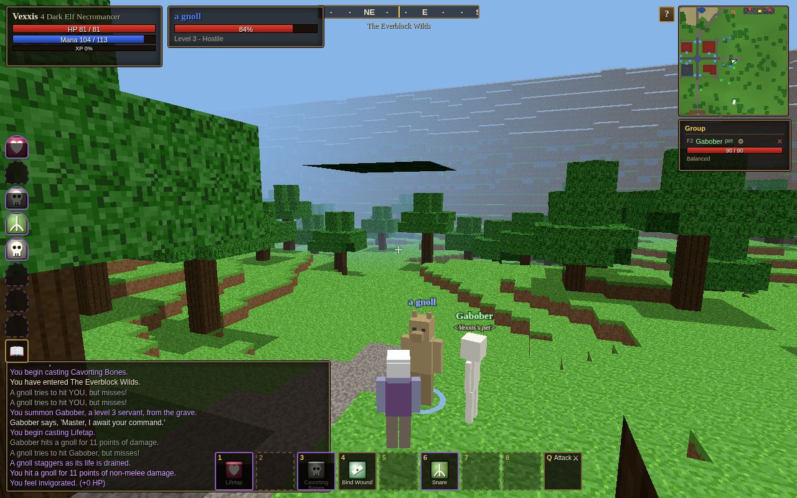

**[▶ Play in your browser](https://ssinjinx.github.io/everblock/)**

A blocky voxel world (Minecraft-style) that plays like **EverQuest Classic (1999)**. You roll a character (race, class, stat points), bind at Everblock Keep, hunt rats and gnolls outside the walls, then work your way through the Sunken Crypt and on to the Frostfang Highlands. There are con colors, auto attack, spell gems and a spellbook, med/sit regen, corpse runs, named mobs and camps. You can also break and place blocks anywhere.

Everything is generated in code: terrain, textures, models, spell icons, sound and music. There are no external assets. The whole game is one self-contained `index.html` (Three.js r149 inlined) that works offline from `file://`. Progress saves to localStorage.

## New in v3
- **Five new classes**: **Ranger** (archery at range, Flame Lick DoT, Snare, Salve, Spirit of Wolf), **Paladin** (Lay on Hands, Bash, Stun, Yaulp, heals), **Shaman** (Sicken DoT, Drowsy slow, Inner Fire, Spirit of Wolf), **Necromancer** (Lifetap, Disease Cloud, Snare, and a **skeletal pet** that grows from Cavorting Bones to Bone Walk to Convoke Shadow), and **Enchanter** (Mesmerize, which breaks on damage, Stun, Chaos Flux, Breeze/Clarity mana regen). EQ-style race restrictions apply: Ogres can't be Rangers, Wood Elves can't be Paladins, and so on.
- **Spellbook & spell gems**: press **K** to open the spellbook. Memorize spells into **8 spell gems** (left edge of the screen). You sit while you memorize and it takes a few seconds; moving or getting hit interrupts it. You can only cast spells you have memorized.
- **Spell icons & a configurable hotbar**: every spell and ability gets a procedurally drawn icon. Drag spells from the book onto the hotbar or gems, or click a spell and then click a slot. Right-click a slot to clear it or a gem to forget the spell.
- **Mercenary upgrades**: click **⚙** in the group window to set a **stance** (passive / balanced / aggressive) and the healer's **heal threshold**, and to **give them gear** (armor and weapons raise their HP, AC and damage, and you can take it back). Fallen mercs stay in the group and can be **revived for a fee** instead of re-hired. Gear, stance and death state are saved.
- **The Warden's Legacy**: a four-part quest chain across both zones (Soulbinder Kerra → Scout Hollis in Frostfang → Warlord Grimtusk's shard → Guildmaster Aldric). The reward is the **Signet of the Everblock Warden** and the title *Warden of Everblock*.
- **New quests**: *Bones of the Restless* (Guard Mossen) and *Yeti Hunt* (Trapper Gunnar at the Frostfang outpost).
- **Synthesized music** that changes mood for town, the wilds, Frostfang and the crypt (**Shift+M**), plus **warm point lights** from nearby lanterns and a player torch at night or underground. These switch on automatically when the frame rate allows; use `/lights` to force them on or off.
- v1/v2 saves load unchanged: old characters get their spells auto-memorized into gems.

## Features
- **Races & classes**: Human, Barbarian, Wood Elf, Dark Elf, Dwarf, Gnome, Ogre / Warrior, Cleric, Wizard, Rogue, Ranger, Paladin, Shaman, Necromancer, Enchanter. Each has EQ-style stats, skills, and spell lines trained at the guildmaster.
- **EQ combat**: con colors, auto attack, casting and fizzles, DoTs, snares, slows, mez and stuns, hate lists and social aggro, fleeing mobs, experience loss and corpse runs
- **Mob pathfinding**: A* on the voxel grid with step-up and drop handling, so mobs chase you around walls and through dungeon doorways
- **Group**: Cleric and Warrior mercenaries from the Mercenary Liaison and a necromancer pet, with EQ-style group XP split (pets don't take a share)
- **Two zones**: the Everblock Wilds (levels 1-10: town, gnoll camp, graveyard, Sunken Crypt) and the Frostfang Highlands (levels 8-15: orc warcamp, yetis, frost giants, Vorgath's Frozen Keep), connected by a zone line
- **Named mobs & loot**: Fippy Darkpaw, Grimbone, Warlord Grimtusk, Vorgath the Frostbound, and more
- **Quests**, a **minimap**, a day/night cycle, and **building** (break and place blocks)

## Controls

| Action | Key |
|---|---|
| Move / jump / look | WASD / Space / Mouse (click to lock pointer) |
| 1st / 3rd person, zoom | V, mouse wheel |
| Target / next target / clear | Left click / Tab / Esc |
| Target self / group members & pet | F1 / F2-F5 |
| Auto attack | Q |
| Hotbar abilities & spells | 1-8 (drag from spellbook; right-click to clear) |
| Spellbook (memorize into gems) | K (click or drag a spell to a gem; double-click to memorize) |
| Cast from a spell gem / forget it | Left click / right click on the gem |
| Consider / sit (regen) | C / X |
| Loot, talk to merchant, trainer, binder, merc liaison | E |
| Hail (quest givers open a dialog) | H |
| Merc stance, heal threshold, gear | ⚙ in the group window |
| Inventory | I |
| Build mode (break / place / pick block) | B (left click / right click / 1-9) |
| Minimap / help / sound / music | N / ? or F10 / M / Shift+M |
| Chat & commands | Enter or `/`: /who /loc /corpse /quests /dismiss /zone /save /music /lights /book /help |

## Screenshots
| | |
|---|---|
| 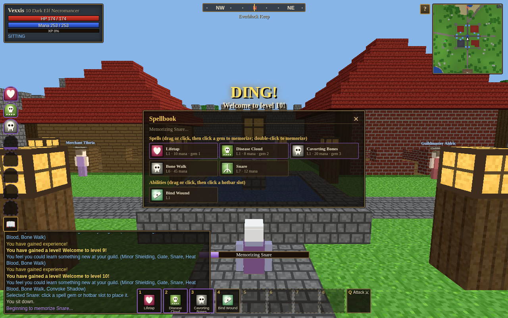 | 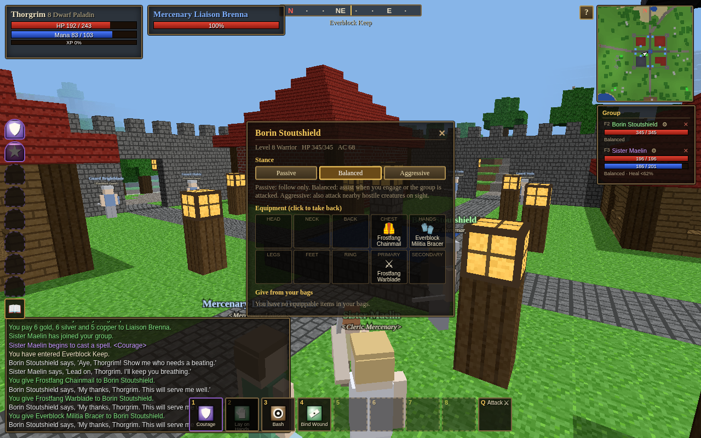 |
| 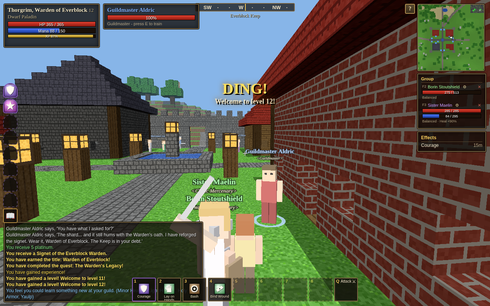 | 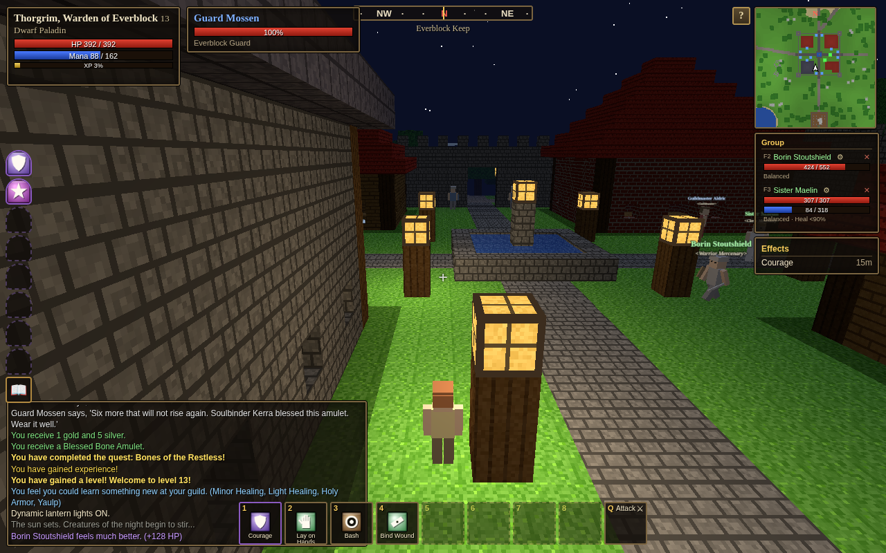 |
| 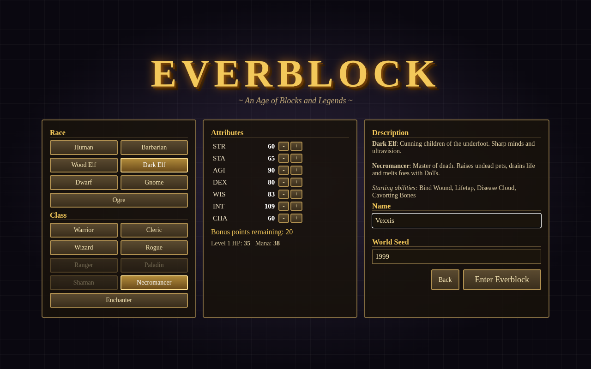 | 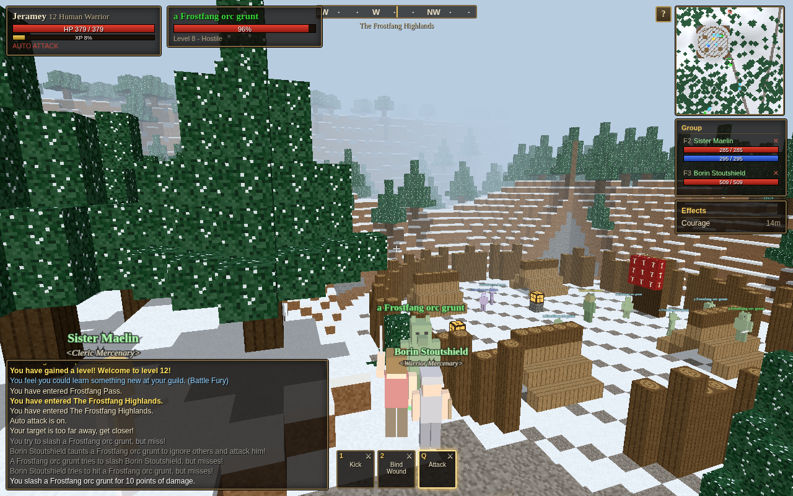 |
| 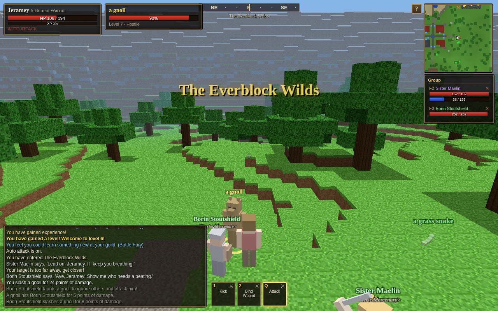 | 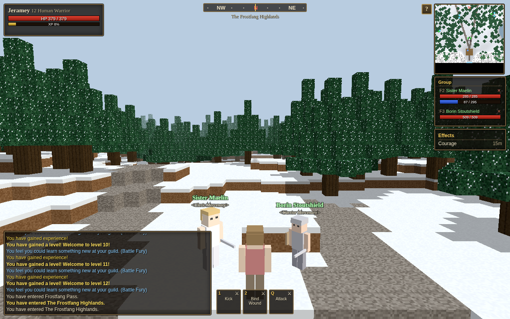 |
| 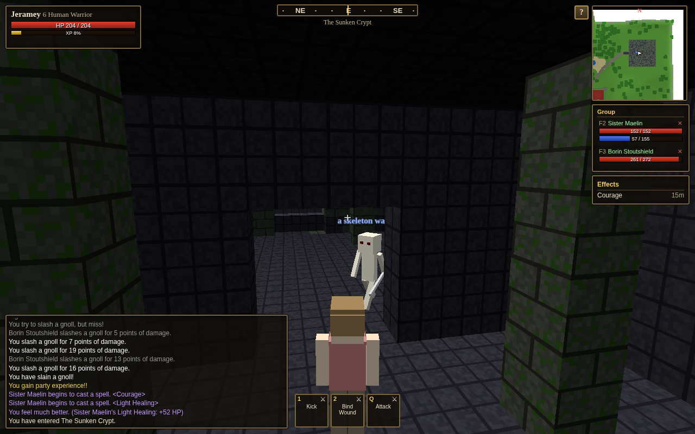 | 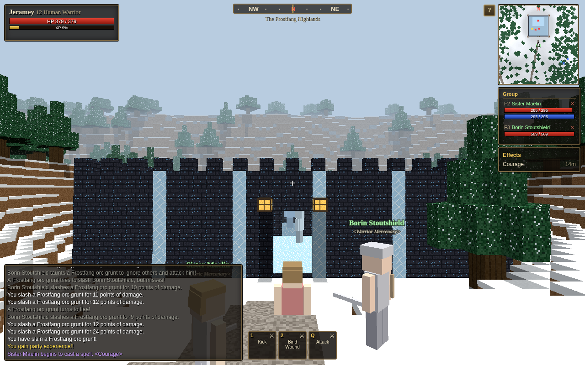 |
| 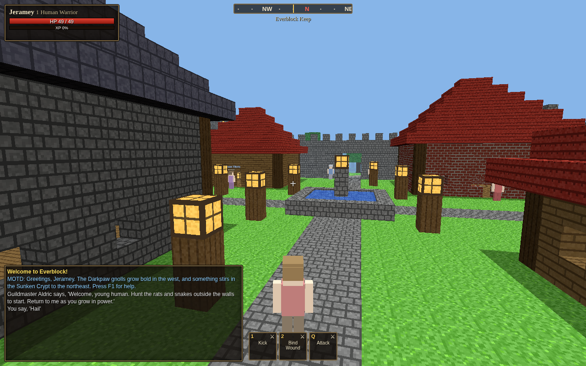 | 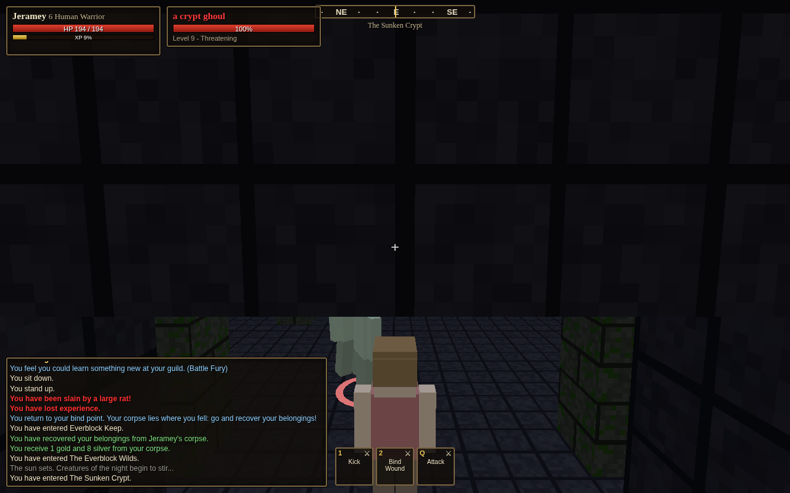 |

## Tech
- Three.js r149 (UMD, vendored), plain JavaScript, no bundler
- Chunked voxel meshing with a procedural texture atlas, DDA block raycasting, AABB voxel physics
- A* pathfinding with a binary heap and per-frame search budget, plus soft entity separation
- Canvas-drawn spell icons; a fixed pool of point lights reassigned to the nearest lanterns, so shaders never recompile
- WebAudio-synthesized sound effects and a generative music loop

### Building from source
```
cd source
python3 build.py     # inlines src/*.js, src/style.css and vendor/three.min.js into ../index.html (and source/dist/everblock.html)
```
For development, open `source/index.html` directly. `source/tools/` contains Playwright scripts for headless Chromium (`npm install`, then `node test.js`, `node test_v2.js` or `node test_v3.js`; they expect Chrome at `/usr/bin/google-chrome`).
